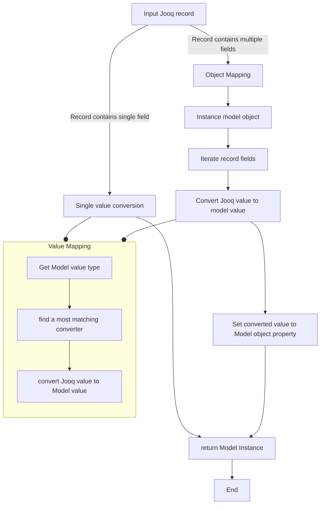
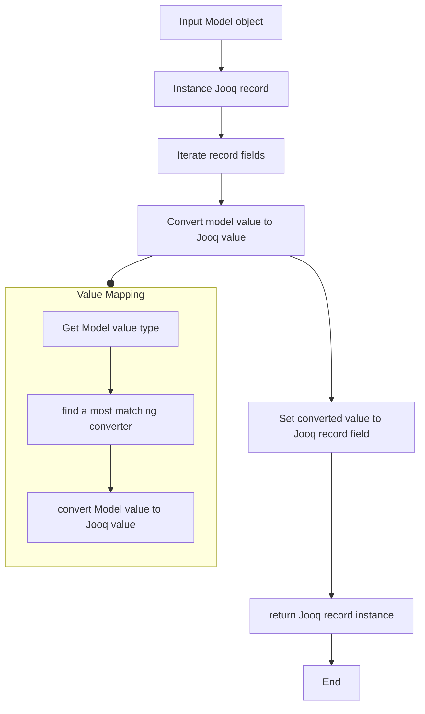

# AGENTS.md

This file provides guidance to Qoder (qoder.com) when working with code in this repository.

## Project Overview

This is a lightweight ORM framework based on Jooq, which provides mapping between Jooq record and Java model object.

## Common Commands

### Build Project
```bash
./gradlew build
```

### Run Tests
```bash
./gradlew test
```

### Compile Java Code
```bash
./gradlew compileJava
```

### Clean Build
```bash
./gradlew clean
```

## Code Architecture

### Core Components

1. **`SkrRecordMapperProvider`**: extends `org.jooq.RecordMapperProvider`, provides `org.jooq.RecordMapper` to map Jooq record to Java model object.
   - **Cascade mapping**: 
2. **`SkrRecordUnmapperProvider`**: extends `org.jooq.RecordUnmapperProvider`, provides `org.jooq.RecordUnmapper` to map Java model object to Jooq record.
3. **`SkrJooqConverter`**: Interface for bi-directional conversion between Jooq value and Java model value.
    ```java
    public interface SkrJooqConverter<ModelType, JooqType> {
        /**
         * Check if the converter matches the model and jooq value types, and return a matching priority
         * @return negative value if the converter does not match the model and jooq value types.
         *         The maximum priority converter will be used.
         *         Built-in converters come with priority 10. Return priority above 10 will override the built-in converters.
         */
        int match(Type modelType, Type jooqType);
        /**
         * Convert the model value to jooq value.
         * @param mVal the model value
         * @return the jooq value
         */
        JooqType convertToJooqType(ModelType mVal);
        /**
         * Convert the jooq value to model value.
         * @param jVal the jooq value
         * @return the model value
         */
        ModelType convertToModelType(JooqType jVal);
    }
    ```
   - This library provides a set of default implementation of `JooqBiConverter` for basic types.
     - String
     - Number(Integer / Long / Float / Double)
     - Boolean
     - `java.time` (JSR 310)
     - `com.fasterxml.jackson.databind.JsonNode`
   - `GenericObjectConverter` provides object cascading mapping. example:
     ```java
     public class Address {
         private String line1;
         private String line2;
         private String city;
     }
     
     public class User {
         private String name;
         private int age;
         private Address address;
     }
             
     // '_' is the separator for nested object mapping.
     Record record = DSL.using(configuration)
        .resultQuery("SELECT name, age, address_line1, address_line2,address_city FROM user WHERE name = 'Hank'")
        .fetchOne();
     User user = record.into(User.class);
     assertThat(user.name, notNullValue());
     assertThat(user.age, notNullValue());
     assertThat(user.address, notNullValue());
     assertThat(user.address.line1, notNullValue());
     assertThat(user.address.line2, notNullValue());
     assertThat(user.address.city, notNullValue());
     ```
   - Allows users to register custom converters for specific types.
4. **`ObjectMapperConfigure`**:
   - Json type conversion based on (jackson)[https://github.com/FasterXML/jackson-databind]
   - Provides default `ObjectMapper` for general purpose.
   - Provides default `ObjectMapper` for persistence purpose only, which supports `@JsonTransient` and other transient annotations.
5. **Java Model Mapping Annotations**: 
   - `@Transient`: Mark the field as transient, which will not be persisted and loaded.
   - `@JsonTransient`: Mark the field as transient for json serialization while persisting.
   - `@LefeoverCollector`: Mark the field of `Map` type, which will collect all unmapping record columns into the map.
   - `@Immutable`: Mark the field is not updatable while updating records.
   - `@MappingInstantiator`: Mark the Constructor or builder is the primary object instantiator during mapping.
     - default to no argument constructor.
   - `@PrimaryKey`: Mark the field as primary key. If a pk field is null after mapping from record, the entire nested object field should be set as null.
6. **Mapping Hook**: Allows users to register custom hooks to intercept the mapping process.
   - `postMapping()`: Hook method to be called after mapping from record to model object.

### Mapping logic flow: Jooq Record to Model Object


### Mapping logic flow: Model Object to Jooq Record


### Testing

- Tests are written using JUnit 5 and are located in `src/test/java`. 
- The test suite should cover all core features of the framework.
- Use H2 database for testing.